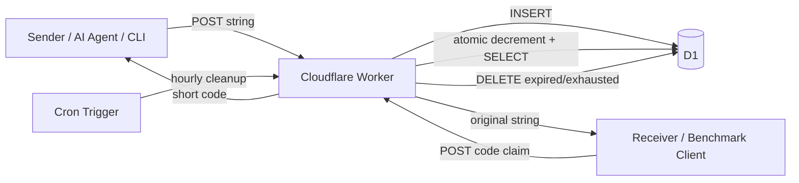

# RendezKey 产品需求文档（PRD）

**状态：** Approved scope / 可进入实施
**日期：** 2026-07-20
**工作名称：** RendezKey
**一句话描述：** 上传一段临时字符串，获得一个短码；在另一台设备上使用短码取回原字符串。

---

## 1. 背景

Iroh 在建立 P2P 连接、传输文件以及执行 benchmark 时，经常需要在两个设备之间传递 ticket。Ticket 通常很长，不适合手工输入，也不方便通过远程终端、电话或 AI 自动化工作流进行快速交换。

RendezKey 提供一个极小的 HTTP 服务：

1. 客户端上传一个 UTF-8 字符串。
2. 服务返回一个适合手工输入的短码。
3. 另一台设备使用短码取回字符串。
4. 字符串默认只能领取一次，并在短时间后过期。

它本质上是一个带 TTL 和领取次数限制的临时映射服务。虽然首要用途是 netsu 的 Iroh ticket 与网络测试协调，但 API 不绑定 Iroh，可用于任意短期字符串。

---

## 2. 目标

### 2.1 产品目标

- 让开发者不再手动复制或输入长 Iroh ticket。
- 使用一条 `curl` 命令即可存储字符串。
- 使用另一条 `curl` 命令即可通过短码领取字符串。
- 默认一次性领取，允许调用者设置最多领取次数。
- 默认 1 小时过期，允许调用者设置 TTL。
- 在 Cloudflare Workers 上部署，使用 D1 持久化。
- 保持实现简单、可测试、低维护成本。
- API 能方便地被 AI agent、CLI、CI 和不同平台客户端调用。

### 2.2 成功标准

一次完整流程应当满足：

```bash
CODE=$(curl -fsS -X POST \
  "https://rendezkey.example.com/v1/entries?ttl=3600&reads=1" \
  -H "Authorization: Bearer $RENDEZKEY_TOKEN" \
  -H "Content-Type: text/plain; charset=utf-8" \
  -H "Accept: text/plain" \
  --data-binary "$IROH_TICKET")

TICKET=$(curl -fsS -X POST \
  "https://rendezkey.example.com/v1/entries/$CODE/claim")
```

其中：

- `CODE` 是短码，例如 `7K3M-Q9TX`。
- `TICKET` 与上传的字符串逐字节一致。
- 默认第二次领取同一个短码返回 `404`.
- 过期后领取返回 `404`.
- 创建操作未携带正确 API token 时返回 `401`.

---

## 3. 非目标

MVP 不实现以下能力：

- 端到端加密或服务器不可见的 payload。
- 本文档描述的 entry v1 不实现 PAKE、SPAKE2、Magic Wormhole mailbox
  或 WebSocket signaling；WebRTC signaling 由独立版本化 spec/plan 定义。
- 用户账号、团队、权限角色和计费。
- Web UI、Dashboard 或管理后台。
- 文件上传；只接收 UTF-8 字符串。
- 自定义短码。
- 永久存储。
- 多区域缓存。
- Ticket 格式解析或 Iroh 协议校验。
- 短码找回、历史记录或列表 API。
- 严格防御恶意托管方；服务器能够读取明文字符串。

---

## 4. 用户与典型场景

### 4.1 Iroh benchmark

开发者在设备 A 启动 benchmark sender，获得一个长 ticket，然后：

1. 将 ticket 上传到 RendezKey。
2. 得到短码。
3. 在设备 B 输入短码。
4. 设备 B 领取 ticket 并启动 latency 或 throughput benchmark。

### 4.2 netsu 多平台测试

AI agent 在 macOS 端创建临时 mapping，将短码交给 Android、Windows、iOS、HarmonyOS 或 Linux 测试端。测试端无需处理长字符串。

### 4.3 CI / 远程设备

CI job 生成连接信息，将短码写入测试日志；远程测试设备在有限时间内领取一次或多次。

---

## 5. 产品范围

### 5.1 创建临时字符串

调用方上传原始 UTF-8 文本，并可指定：

- `ttl`: 生存时间，单位秒。
- `reads`: 最大成功领取次数。

默认值：

| 参数         |    默认 |   最小 |              最大 |
| ------------ | ------: | -----: | ----------------: |
| TTL          | 3600 秒 |  60 秒 | 604800 秒（7 天） |
| 最大领取次数 |       1 |      1 |               100 |
| Payload 大小 |       — | 1 byte |       65536 bytes |

成功后返回：

- 短码。
- 过期时间。
- 最大领取次数。

### 5.2 领取字符串

领取接口输入短码，并返回原始字符串。

每次成功领取：

- `remaining_reads` 原子减 1。
- 当次数耗尽后，后续请求无法再领取。
- 即使物理记录尚未清理，也必须被视为不存在。

### 5.3 过期

- 所有领取请求都必须实时检查 `expires_at`.
- 过期记录不可领取。
- Cron Trigger 每小时清理过期记录和领取次数已耗尽的记录。
- 正确性不能依赖 Cron；Cron 只负责回收存储空间。

---

## 6. 短码设计

### 6.1 格式

短码由 8 个字符组成，显示为：

```text
7K3M-Q9TX
```

数据库中规范化保存为：

```text
7K3MQ9TX
```

输入时允许：

- 大写或小写。
- 有或没有连字符。
- 包含空格。

例如以下输入等价：

```text
7K3M-Q9TX
7k3mq9tx
7K3M Q9TX
7K3MQ9TX
```

### 6.2 字符表

使用 32 个易输入字符：

```text
23456789ABCDEFGHJKLMNPQRSTUVWXYZ
```

该字符表：

- 不包含 `0` 和 `O`.
- 不包含 `1` 和 `I`.
- 每个字符承载 5 bits。
- 8 个字符提供 40 bits 随机空间。

短码必须使用 `crypto.getRandomValues()` 生成，禁止使用 `Math.random()`。

### 6.3 冲突处理

`code` 是 D1 主键。

创建时：

1. 生成随机 code。
2. 尝试插入。
3. 如果违反唯一约束，重新生成。
4. 最多重试 5 次。
5. 五次均冲突则返回 `503 code_generation_failed`.

正常规模下发生冲突的概率极低，但实现仍必须正确处理。

---

## 7. HTTP API

Base URL 示例：

```text
https://rendezkey.example.com
```

所有响应均设置：

```http
Cache-Control: no-store
```

服务不使用 CDN Cache API。

### 7.1 健康检查

```http
GET /healthz
```

响应：

```http
200 OK
Content-Type: application/json
```

```json
{
  "status": "ok",
  "service": "rendezkey"
}
```

健康检查不访问 D1，不需要认证。

---

### 7.2 创建 entry

```http
POST /v1/entries?ttl=3600&reads=1
Authorization: Bearer <API_TOKEN>
Content-Type: text/plain; charset=utf-8
Accept: application/json
```

Body 是需要保存的原始字符串。

#### JSON 响应

```http
201 Created
Content-Type: application/json
```

```json
{
  "code": "7K3M-Q9TX",
  "expires_at": "2026-07-20T16:00:00.000Z",
  "max_reads": 1
}
```

#### Plain-text 响应

当请求携带：

```http
Accept: text/plain
```

返回：

```http
201 Created
Content-Type: text/plain; charset=utf-8
X-RendezKey-Expires-At: 2026-07-20T16:00:00.000Z
X-RendezKey-Max-Reads: 1
```

```text
7K3M-Q9TX
```

#### 参数错误

无效的 `ttl`、`reads`、content type 或 payload 大小时返回：

```http
400 Bad Request
Content-Type: application/problem+json
```

```json
{
  "type": "https://rendezkey.dev/problems/invalid-request",
  "title": "Invalid request",
  "status": 400,
  "code": "invalid_request",
  "detail": "reads must be an integer between 1 and 100"
}
```

#### 认证

创建接口始终要求：

```http
Authorization: Bearer <API_TOKEN>
```

Token 存储为 Cloudflare Worker secret，不能写入 `wrangler.jsonc` 或源代码。

---

### 7.3 领取 entry

```http
POST /v1/entries/{code}/claim
```

请求体为空。

成功响应：

```http
200 OK
Content-Type: text/plain; charset=utf-8
Cache-Control: no-store
X-RendezKey-Remaining-Reads: 0
X-RendezKey-Expires-At: 2026-07-20T16:00:00.000Z
```

Body 是上传时的原始字符串。

领取接口默认只需要短码，不要求 API token。短码本身是临时 bearer capability。

如果以后需要将服务完全限制为自己的设备，可通过部署配置增加 `CLAIM_AUTH_REQUIRED=true`，但该开关不属于 MVP 的必要验收条件。

#### 不可领取

以下情况统一返回同一个结果：

- code 不存在。
- code 格式无效。
- entry 已过期。
- 领取次数已耗尽。

```http
404 Not Found
Content-Type: application/problem+json
```

```json
{
  "type": "https://rendezkey.dev/problems/not-found",
  "title": "Entry not available",
  "status": 404,
  "code": "entry_not_available"
}
```

服务不能通过错误信息泄露 entry 是过期、耗尽还是从未存在。

---

## 8. 数据模型

D1 migration：

```sql
CREATE TABLE entries (
  code TEXT PRIMARY KEY,
  value TEXT NOT NULL,
  created_at INTEGER NOT NULL,
  expires_at INTEGER NOT NULL,
  max_reads INTEGER NOT NULL CHECK (max_reads BETWEEN 1 AND 100),
  remaining_reads INTEGER NOT NULL CHECK (remaining_reads >= 0),
  last_claim_id TEXT
);

CREATE INDEX idx_entries_cleanup
ON entries (expires_at, remaining_reads);
```

时间统一使用 Unix epoch seconds。

字段说明：

| 字段              | 说明                           |
| ----------------- | ------------------------------ |
| `code`            | 规范化后的 8 字符短码          |
| `value`           | 原始 UTF-8 字符串明文          |
| `created_at`      | 创建时间                       |
| `expires_at`      | 过期时间                       |
| `max_reads`       | 创建时设置的最大领取次数       |
| `remaining_reads` | 剩余成功领取次数               |
| `last_claim_id`   | 用于原子领取事务的随机请求标识 |

---

## 9. 原子领取设计

不能使用以下流程：

```text
SELECT remaining_reads
UPDATE remaining_reads
```

因为并发请求可能同时通过检查，导致领取次数超出上限。

推荐通过 D1 `batch()` 在单个事务中执行：

```sql
UPDATE entries
SET
  remaining_reads = remaining_reads - 1,
  last_claim_id = ?1
WHERE
  code = ?2
  AND expires_at > ?3
  AND remaining_reads > 0;
```

随后在同一个 batch 中执行：

```sql
SELECT value, remaining_reads, expires_at
FROM entries
WHERE code = ?1 AND last_claim_id = ?2
LIMIT 1;
```

实际参数顺序由 repository 实现固定。每个请求使用 `crypto.randomUUID()` 生成唯一 `claim_id`。只有本次 UPDATE 成功时，第二条 SELECT 才能匹配该 `claim_id`。

Cloudflare D1 文档说明 `batch()` 中的语句顺序执行，并作为 SQL transaction 处理；任一语句失败时整个 batch 回滚。

---

## 10. Cloudflare 架构



### 10.1 组件

- **Cloudflare Worker**

  - HTTP routing。
  - 输入校验。
  - API token 校验。
  - code 生成和规范化。
  - D1 调用。
  - 响应格式。
  - Scheduled cleanup。

- **Cloudflare D1**

  - 保存临时 mapping。
  - 负责唯一约束。
  - 通过 transaction 保证领取次数正确。

- **Wrangler**
  - 本地开发。
  - D1 migration。
  - secret 管理。
  - production 部署。
  - 类型生成。

### 10.2 为什么不使用 Workers KV

Workers KV 非常像该产品的数据模型，也支持自动 TTL，但不作为 MVP 存储，原因是：

- KV 是 eventual consistency。
- 新创建的 key 在其他 Cloudflare location 可能需要较长时间才可见。
- negative lookup 也可能被缓存。
- KV 不适合需要原子操作或单事务读写的场景。
- `remaining_reads` 的并发扣减很难正确实现。

RendezKey 的核心行为是“刚创建后立即在另一台设备领取”，并且要严格限制成功领取次数，因此 D1 更合适。

### 10.3 为什么不使用 Durable Objects

Durable Objects 可以实现强一致 per-key state，但对于低流量、简单临时映射属于额外复杂度。D1 已经能够满足持久化、事务和清理需求。

### 10.4 为什么不加缓存

典型 entry 是：

- 写入一次。
- 读取一到数次。
- 每次读取都会改变状态。
- 很快过期。

缓存不会带来明显收益，反而会使耗尽和过期行为更难保证。

---

## 11. 基础安全要求

该服务不追求高安全等级，但必须满足以下基本要求：

- 所有公网请求通过 HTTPS。
- 创建接口必须使用 Bearer token。
- API token 使用 Worker secret。
- 使用 `crypto.subtle.timingSafeEqual()` 比较 token。
- 使用 `crypto.getRandomValues()` 生成短码。
- 不在日志中记录：
  - 原始 payload。
  - Authorization header。
  - 完整短码。
- 所有领取响应设置 `Cache-Control: no-store`.
- 统一不可领取错误，避免泄露 entry 状态。
- 对请求体执行 64 KiB 硬限制。
- SQL 全部使用 prepared statements 和参数绑定。
- 不使用模块级可变变量保存请求状态。
- 所有 Promise 必须 `await`、`return` 或交给 `ctx.waitUntil()`。

明确限制：

> Worker 和 D1 会看到并存储明文字符串。该服务仅用于 benchmark、开发和临时测试，不应保存密码、长期凭证、私钥或高敏感数据。

---

## 12. 清理策略

### 12.1 Lazy validation

每次 claim 都包含条件：

```sql
expires_at > now
AND remaining_reads > 0
```

因此 Cron 失败也不会使过期数据重新可用。

### 12.2 Scheduled cleanup

Wrangler 配置：

```jsonc
{
  "triggers": {
    "crons": ["0 * * * *"],
  },
}
```

每小时执行：

```sql
DELETE FROM entries
WHERE code IN (
  SELECT code
  FROM entries
  WHERE expires_at <= ?1 OR remaining_reads <= 0
  LIMIT 1000
);
```

Scheduled handler 可循环有限批次，但单次最多处理固定数量，避免维护任务占用过长执行时间。MVP 可每次只删一批，下一小时继续。

---

## 13. Observability

开启 Worker observability 和 structured JSON logs。

允许记录：

```json
{
  "event": "entry_created",
  "request_id": "...",
  "payload_bytes": 412,
  "ttl_seconds": 3600,
  "max_reads": 1,
  "status": 201
}
```

```json
{
  "event": "entry_claimed",
  "request_id": "...",
  "remaining_reads": 0,
  "status": 200
}
```

禁止记录 payload 和完整 code。

建议 metric：

- 创建成功数。
- claim 成功数。
- claim 404 数。
- 401 数。
- 400 数。
- D1 error 数。
- cleanup 删除数量。
- p50 / p95 Worker request latency。

---

## 14. 错误码

| HTTP | `code`                   | 场景                               |
| ---: | ------------------------ | ---------------------------------- |
|  400 | `invalid_request`        | query、content type 或 body 不合法 |
|  401 | `unauthorized`           | 创建时 token 缺失或错误            |
|  404 | `entry_not_available`    | code 无效、不存在、过期或耗尽      |
|  413 | `payload_too_large`      | UTF-8 body 超过 64 KiB             |
|  500 | `internal_error`         | 未分类服务端错误                   |
|  503 | `code_generation_failed` | 连续 5 次 code 冲突                |

错误响应使用 `application/problem+json`，不返回 stack trace、D1 SQL 或 secret。

---

## 15. 测试要求

### 15.1 单元测试

- 5-byte 随机值正确编码为 8 字符。
- 输出字符全部属于指定 alphabet。
- 格式化为 `XXXX-XXXX`.
- 输入规范化。
- 非法长度和字符被拒绝。
- TTL 和 reads 边界。
- token timing-safe comparison。
- UTF-8 byte size 校验。

### 15.2 Worker 集成测试

- 创建 entry 返回短码。
- `Accept: text/plain` 返回纯 code。
- 默认只可 claim 一次。
- `reads=3` 恰好成功 3 次。
- 过期 entry 无法领取。
- 缺少 token 无法创建。
- 错误 token 无法创建。
- 64 KiB payload 成功。
- 超过 64 KiB 返回 413。
- 多个并发 claim 的成功数不超过 `max_reads`.
- cleanup 删除过期或耗尽数据。
- 每个响应都有 `Cache-Control: no-store`.

### 15.3 部署 smoke test

部署后执行：

```bash
export BASE_URL="https://..."
export RENDEZKEY_TOKEN="..."

VALUE="iroh-ticket-test-$(date +%s)"

CODE=$(curl -fsS -X POST \
  "$BASE_URL/v1/entries?ttl=60&reads=1" \
  -H "Authorization: Bearer $RENDEZKEY_TOKEN" \
  -H "Content-Type: text/plain; charset=utf-8" \
  -H "Accept: text/plain" \
  --data-binary "$VALUE")

RESULT=$(curl -fsS -X POST \
  "$BASE_URL/v1/entries/$CODE/claim")

test "$RESULT" = "$VALUE"

STATUS=$(curl -sS -o /dev/null -w "%{http_code}" \
  -X POST "$BASE_URL/v1/entries/$CODE/claim")

test "$STATUS" = "404"
```

---

## 16. 发布范围

### MVP

- Worker HTTP API。
- D1 schema 和 migrations。
- 创建、领取、健康检查。
- TTL。
- 可配置读取次数。
- 创建 API token。
- Cron cleanup。
- Vitest 测试。
- production deployment config。
- README 与 curl 示例。

### 后续可选增强

- Claim 接口也要求 API token。
- Cloudflare Rate Limiting binding。
- 手动 delete endpoint。
- 二进制 payload。
- QR code。
- CLI wrapper。
- OpenAPI spec。
- 客户端加密。
- 自定义 domain。
- 统计 Dashboard。

这些能力均不得阻塞 MVP。

---

## 17. 验收标准

项目完成需要同时满足：

- [ ] 可以上传 1–65536 bytes UTF-8 string。
- [ ] 创建返回 8 字符 human-safe code。
- [ ] code 可带或不带 `-` 输入。
- [ ] 默认 TTL 为 3600 秒。
- [ ] 默认最大读取次数为 1。
- [ ] `ttl` 和 `reads` 可以在允许范围内覆盖。
- [ ] 领取返回原始 string，内容完全一致。
- [ ] claim 次数在并发情况下不会超过 `max_reads`.
- [ ] 过期或耗尽后统一返回 404。
- [ ] 创建接口使用 Worker secret 中的 API token。
- [ ] D1 中不会永久积累过期记录。
- [ ] 测试覆盖核心成功和失败路径。
- [ ] production smoke test 通过。
- [ ] 日志中不包含 payload、token 或完整 code。
- [ ] `wrangler deploy --dry-run`、类型检查和测试全部成功。

---

## 18. 技术决策摘要

| 决策        | 选择                                  |
| ----------- | ------------------------------------- |
| 项目名      | RendezKey（working title）            |
| Compute     | Cloudflare Workers                    |
| Router      | Hono                                  |
| Storage     | D1                                    |
| Cache       | 无                                    |
| Code        | 8-char human-safe Base32，显示为 4-4  |
| Payload     | UTF-8 text，最大 64 KiB               |
| TTL         | 默认 1 小时，最大 7 天                |
| Reads       | 默认 1，最大 100                      |
| Create auth | Bearer API token                      |
| Claim auth  | code only                             |
| Cleanup     | Lazy validation + hourly Cron         |
| Tests       | Vitest + Cloudflare Workers test pool |
| E2EE        | 不在 MVP                              |

---

## 19. 参考资料

- [Cloudflare Skills repository](https://github.com/cloudflare/skills/tree/main/skills)

- [Cloudflare platform skill](https://github.com/cloudflare/skills/blob/main/skills/cloudflare/SKILL.md)

- [Workers best-practices skill](https://github.com/cloudflare/skills/blob/main/skills/workers-best-practices/SKILL.md)

- [Wrangler skill](https://github.com/cloudflare/skills/blob/main/skills/wrangler/SKILL.md)

- [Workers Best Practices](https://developers.cloudflare.com/workers/best-practices/workers-best-practices/)

- [D1 Workers Binding API](https://developers.cloudflare.com/d1/worker-api/)

- [D1 Database API and batch transactions](https://developers.cloudflare.com/d1/worker-api/d1-database/)

- [Workers KV consistency model](https://developers.cloudflare.com/kv/concepts/how-kv-works/)

- [Cron Triggers](https://developers.cloudflare.com/workers/configuration/cron-triggers/)

- [Worker Secrets](https://developers.cloudflare.com/workers/configuration/secrets/)

- [Worker Web Crypto](https://developers.cloudflare.com/workers/runtime-apis/web-crypto/)
